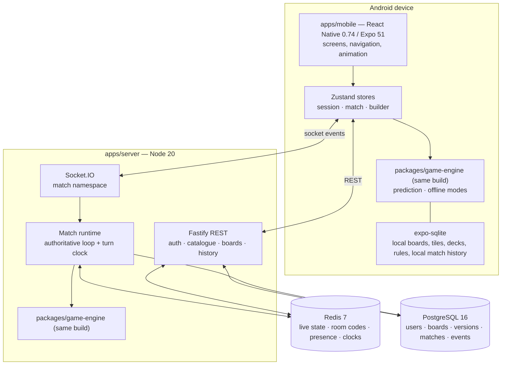
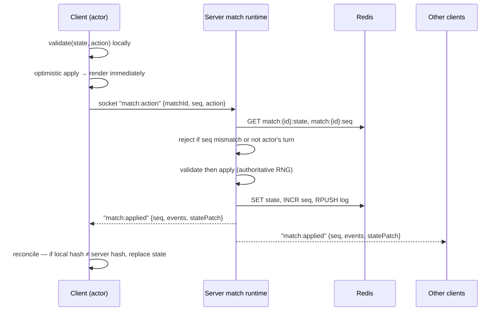

# 01 · Architecture

> Generated from `Royal Navy 1080 v2.dc.html` — 49 options / 93 screens (Session 9 export) · 19 September 2026.

## Module boundaries



### Dependency rules (enforced by lint)

| Package | May import | Must never import |
| --- | --- | --- |
| `packages/game-engine` | `packages/shared` | React, React Native, Node stdlib, fs, net, Date.now, Math.random |
| `packages/shared` | nothing | anything platform-specific |
| `apps/server` | shared, game-engine | `apps/mobile` |
| `apps/mobile` | shared, game-engine | `apps/server` |

`game-engine` receives time and randomness as **inputs**: every action carries `atMs`, and every
random draw consumes the seeded RNG held in state. This is what makes replay exact.

## The one-engine rule

The same reducer runs in three places:

1. **Server**, as the authority for online matches.
2. **Client**, as prediction for online matches (apply locally, reconcile on the authoritative diff).
3. **Client alone**, as the whole game for pass-and-play and solo vs AI — no server involved.

```ts
// packages/game-engine/src/index.ts — the entire public surface
export function createMatch(setup: MatchSetup): MatchState;
export function legalActions(s: MatchState, playerId: PlayerId): ActionKind[];
export function validate(s: MatchState, a: Action): ValidationResult;   // never throws
export function apply(s: MatchState, a: Action): ApplyResult;           // { state, events }
export function checkInvariants(s: MatchState): InvariantViolation[];   // [] when healthy
export function netWorth(s: MatchState, playerId: PlayerId): number;
export function rentFor(s: MatchState, tileIndex: number, roll?: number): number;
```

`apply` is pure: `(state, action) → { state, events }`. It never mutates its input, never does I/O,
and produces the same output for the same input on any machine. `events` is the list the match log
and the notification cards (`1n`) are built from.

## Online match data flow



- **Sequence numbers** order everything. A client sends the `seq` it believes is current; a mismatch
  is rejected with `E_STALE_SEQ` and the client requests a full `match:sync`.
- **Patches, not full state**, on the wire — except after reconnect or a rejected seq, where the
  server sends the whole state.
- **Randomness is server-side only** in online play. The client's optimistic apply skips any random
  action (dice, card draw) and shows the rolling animation until the authoritative result lands.

## Turn clock

The turn timer is a board rule (15 / 30 / 45 s / Off). The server owns it as a Redis key
`turnclock:{matchId}` holding a deadline. A single in-process scheduler polls due clocks every
250 ms and applies the expiry action through the engine. Clients render a countdown from the
deadline they were given; they never decide expiry. *(Client-side expiry feedback is **OQ-1**.)*

## Offline modes

Pass-and-play and solo vs AI run entirely on the device: `createMatch` with a locally generated
seed, the engine in the store, AI decisions computed by `packages/game-engine/ai`, and the result
written to local SQLite. Nothing is sent to the server *(upload policy is **OQ-9**)*.

## Board and content storage

| Object | Lives | Mutable |
| --- | --- | --- |
| Local board, tiles, decks, rules | Device SQLite | yes, freely |
| Published board **version** | Postgres | **never** |
| Published version's decks and rules | Postgres, as copies inside the version | never |
| Match | Redis while live, Postgres when ended | state advances, history is append-only |

A published version is a **self-contained document**: tiles, prices, colour groups, decks and the
full ruleset, so it plays identically on a device whose library is completely different (D5).

## Client structure

```
apps/mobile/src/
  app/            expo-router routes — one folder per navigation group
  screens/        one folder per screen doc, named after the option id
  components/     design-system components (03-design-system.md)
  tokens/         re-export of packages/shared tokens
  stores/         session, match, builder, catalogue (Zustand)
  net/            api client (REST) + socket client with reconnect policy
  engine/         thin adapter around packages/game-engine
  local/          SQLite schema + repositories for local content
  anim/           Reanimated helpers: tokenHop, diceTumble, countUp, pulse
```

Screens are dumb: they read from a store and dispatch intents. No screen calls `fetch` or the socket
directly. No screen contains a rule.

## Server structure

```
apps/server/src/
  boot.ts         env validation, db/redis, plugin registration, healthz
  routes/         auth, boards, catalogue, matches, history, reports, account
  socket/         namespace, auth middleware, handlers, presence, turn clock
  match/          runtime: load, apply, persist, end, reconnect
  db/             migrations, queries (no ORM — plain SQL with a query builder)
  moderation/     name filters, blocklists
  ai/             server-side AI for a disconnected player's auto-action
```

No ORM. Plain parameterised SQL in `db/queries`, one file per table group, so a developer new to
Node can read exactly what hits the database.

## Failure posture

| Failure | Behaviour |
| --- | --- |
| Socket drops | Client shows `3k` reconnect overlay, retries with backoff 1/2/4/8/16 s, then manual retry. Server keeps the seat for `RECONNECT_GRACE_SECONDS` (90). |
| Grace expires | Server auto-plays the minimum legal action each turn (`player_auto_skipped`) and the player rejoins into the live match. |
| Redis unavailable | Live matches cannot advance. Server returns `E_MATCH_UNAVAILABLE`; clients show the retry overlay. No silent local advance. |
| Postgres unavailable | Auth, catalogue and history fail with `E_BACKEND_DOWN`. Live matches continue from Redis; persistence is retried on match end with a queue in Redis. |
| Engine invariant violated | Server refuses the action, logs `engine_invariant_violated` at error, and sends the client a full `match:sync`. The match does not advance. |
| Client and server disagree | Server wins, always, by full state replacement. |
