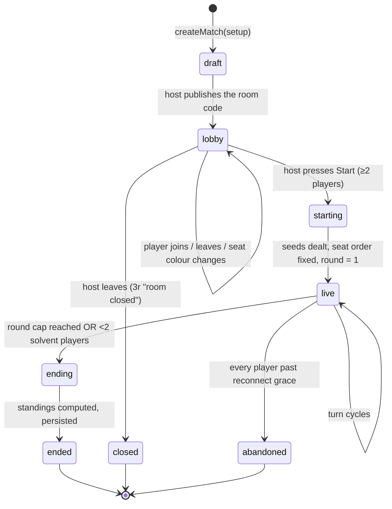
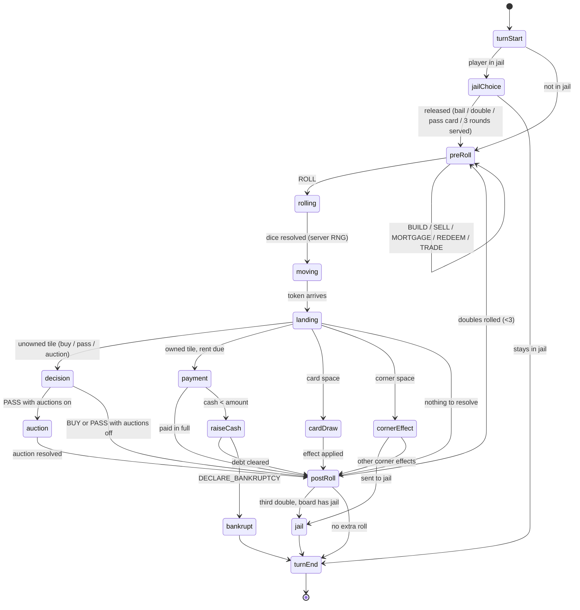
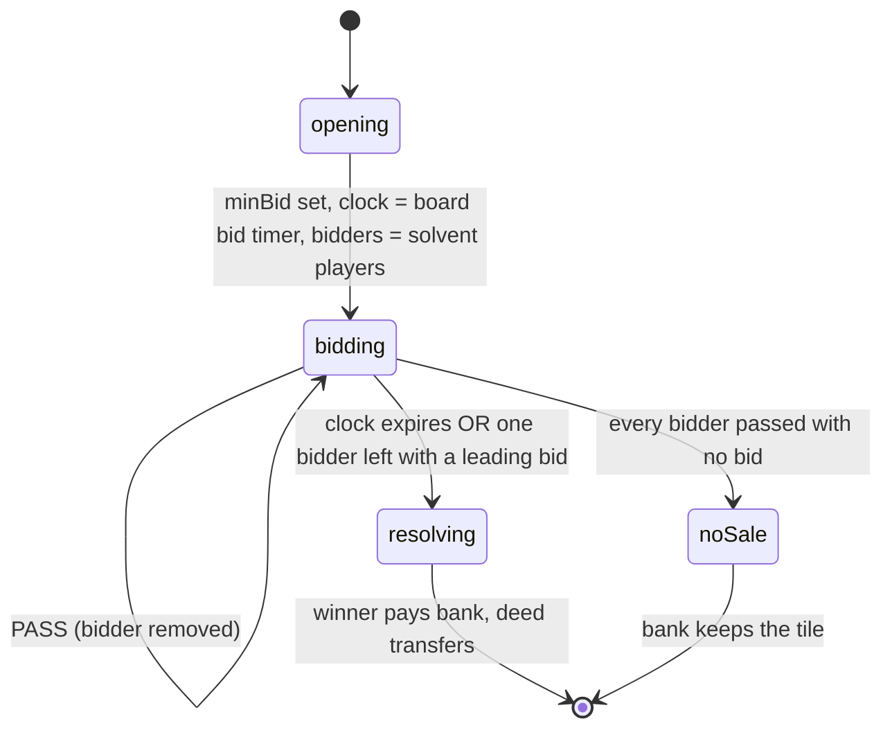
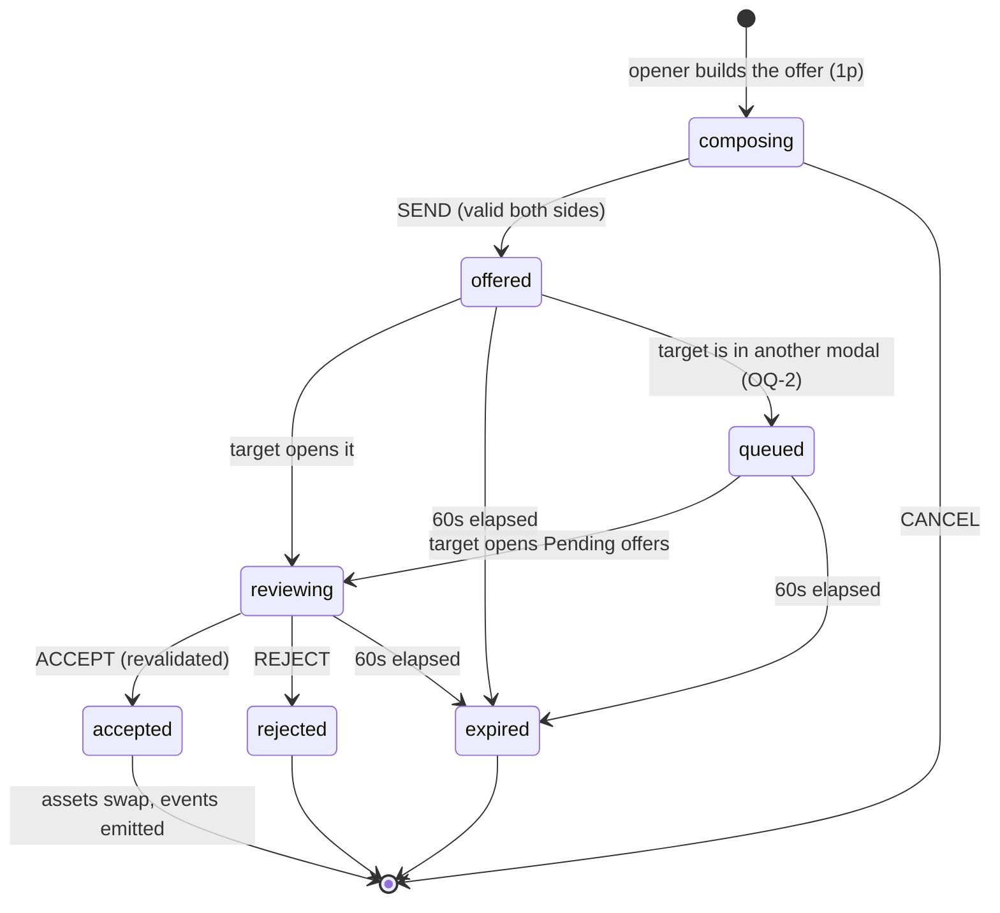
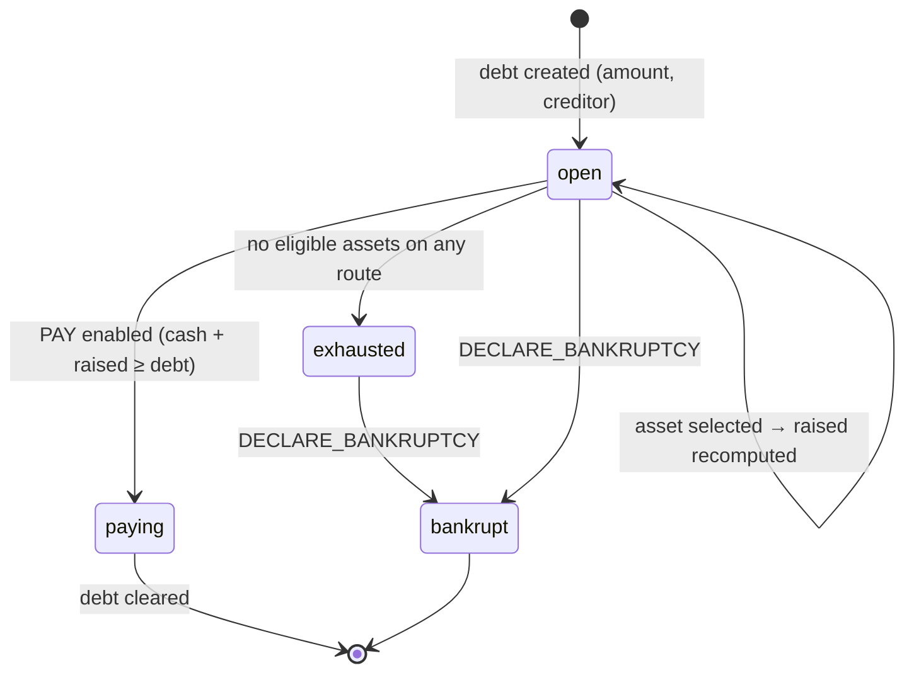
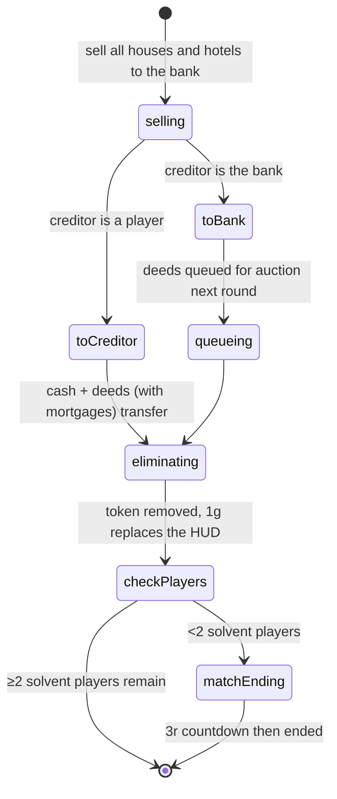
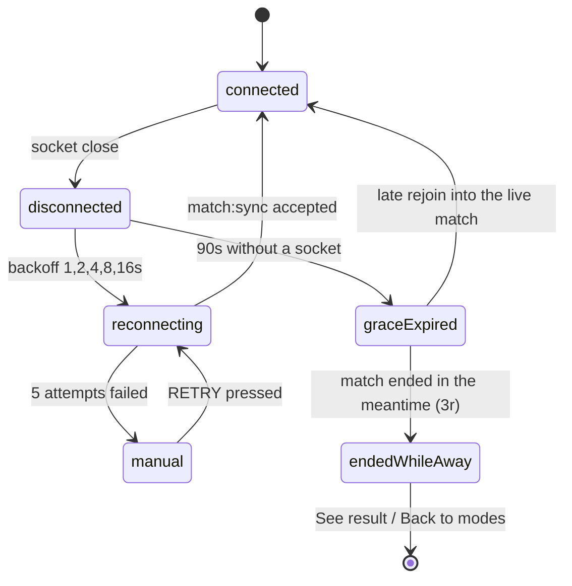
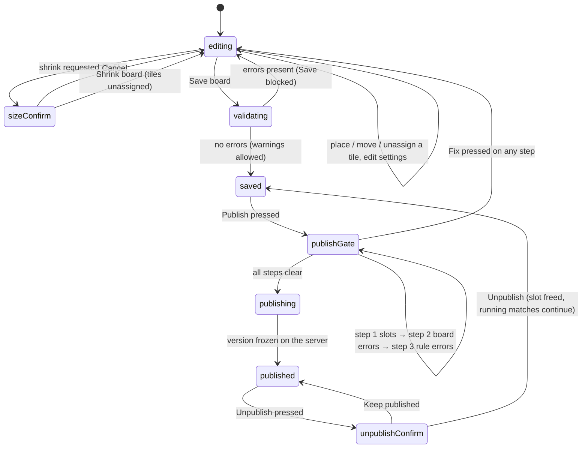
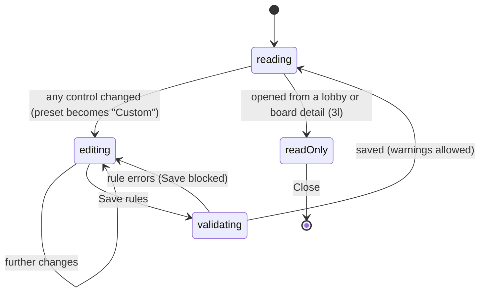

# 06 · State machines

> Generated from `Royal Navy 1080 v2.dc.html` — 49 options / 93 screens (Session 9 export) · 19 September 2026.

All machines live in `packages/game-engine`. They are **data**, not classes: a discriminated union
for the state plus a transition function. The server and client run identical copies.

## Match lifecycle

| State | Who may act | Persisted |
| --- | --- | --- |
| `draft` | host only | Redis |
| `lobby` | host (start, kick), players (leave, colour) | Redis + room code |
| `starting` | nobody (server transition) | Redis |
| `live` | the actor, plus any bidder during an auction | Redis, log appended |
| `ending` | nobody | Redis |
| `ended` | nobody | Postgres |
| `abandoned` | nobody | Postgres, `end_reason = 'abandoned'` |
| `closed` | nobody | not persisted |

## Turn

Guards:

| Transition | Guard |
| --- | --- |
| `preRoll → rolling` | actor's turn, no unresolved debt |
| `preRoll → preRoll` (side actions) | no unresolved debt; action's own validation passes |
| `postRoll → preRoll` | `dice[0] === dice[1]` and `doublesThisTurn < 3` and the roll was not `chooseDice` |
| `payment → raiseCash` | `amount > cash` |
| `raiseCash → postRoll` | `cash ≥ debt` after the payment |
| any → `turnEnd` on timer | server turn clock expiry (see `05-game-rules` §14) |

## Auction

- `BID` validation: `amount ≥ max(minBid, leading + 1)`, `amount ≤ bidder.cash`, bidder not passed,
  bidder has no unresolved debt.
- Escrow: the leading bid is held out of the bidder's spendable cash and released on being outbid.
- Bankruptcy auctions queue one tile at a time and start the round after the estate resolves
  ("Auctions begin next round").
- The turn clock is **paused** while an auction is live.

## Trade

Revalidation at accept time is mandatory — the board may have changed since the offer was made
(`E_TRADE_INVALID`).

## Raise cash

The screen cannot be dismissed while `open`; Android back is a no-op.

## Bankruptcy

## Reconnect

While `disconnected` or `reconnecting` the client shows `3k` and blocks every action. The server
auto-plays the seat once grace expires.

## Board builder (client-only)

The gate order is exactly **slots filled → board errors → rule errors → publish**, with
"Each step unlocks the next" and steps after the first failing step dimmed.

## Rule lab (client-only)

Rule-lab validation checks **rules only**; tiles, slots and colour-set counts are checked in Board
settings ("This panel only checks the rules.").
