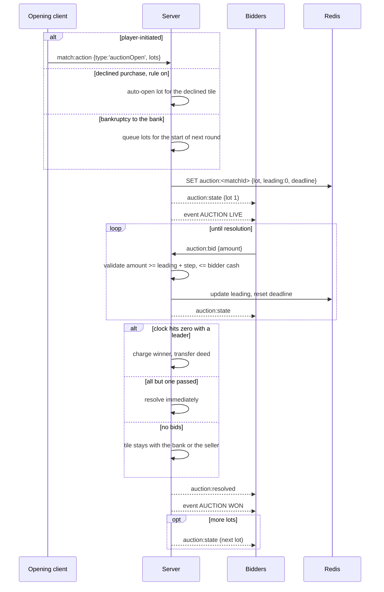

# Flow · Auction

> Generated from `Royal Navy 1080 v2.dc.html` (Session 9 export) · 19 September 2026.
> Screens: `1s` setup, `1t` bidding, `1n` auction-live and auction-won cards.

## Sequence

## Steps

| # | Step | Screen | Validation | Result |
| --- | --- | --- | --- | --- |
| 1 | Open | `1s`, or automatic | ≥ 1 lot, ≥ 2 eligible bidders | every eligible client opens `1t` |
| 2 | Announce | `1n` `AUCTION LIVE` | — | `Skip` stays out; `Join Auction` focuses `1t` |
| 3 | Bid | `1t` | ≥ leading + bid step, ≤ bidder cash, not passed, not the seller | history row appended, clock reset to the board's bid timer |
| 4 | Pass | `1t` | not already passed | final for that lot; controls lock |
| 5 | Resolve | `1t` | clock zero, or all but one passed | winner charged, deed transferred, `AUCTION WON` card |
| 6 | Next lot | `1t` | more lots queued | fresh clock, header updates |
| 7 | Close | `1c` | no lots left | the screen closes and the turn continues |

## Parameters (all from the board, decision D1)

| Parameter | Default |
| --- | --- |
| Start price | ₹100 |
| Bid step | ₹100 |
| Bid timer | 15s (30s on the drawn board) |
| Eligible bidders | active players excluding the seller |

## Failure branches

| Branch | Handling |
| --- | --- |
| Bid below the minimum | Server refuses, `E_BID_TOO_LOW`; the client's stepper already clamps, so this indicates a stale leading value — the client re-syncs from `auction:state` |
| Bid above the bidder's cash | Refused, `E_INSUFFICIENT_CASH`; the client clamps too |
| Two bids in the same tick | Server orders by arrival; the later bid is refused if it no longer clears the minimum, and its client is re-synced |
| Winner short after the fact (card effect) | `1d` opens with the auction debt; failing to settle resolves as bankruptcy and the lot returns to the bank |
| Bidder disconnects | Treated as passed for that lot after their 45s turn hold expires; earlier bids stand |
| Everyone disconnects | The auction is suspended; the clock stops until someone returns, then resumes with its remaining time |
| No bids | The lot goes to the bank (or stays with the seller for a player-initiated lot); a match-log line records it |
| Auctions off on the board | The flow never starts; declining a purchase simply ends the resolution |

## Invariants

1. The clock is server-authoritative; no client may extend it.
2. A bid always resets the clock to the board's full bid timer.
3. Passing is irreversible for that lot.
4. A player can never be charged more than their cash at the moment of resolution.
5. Lots resolve strictly in order; a lot's outcome is applied before the next opens.
6. Mortgaged lots transfer their mortgage to the winner along with the deed.
