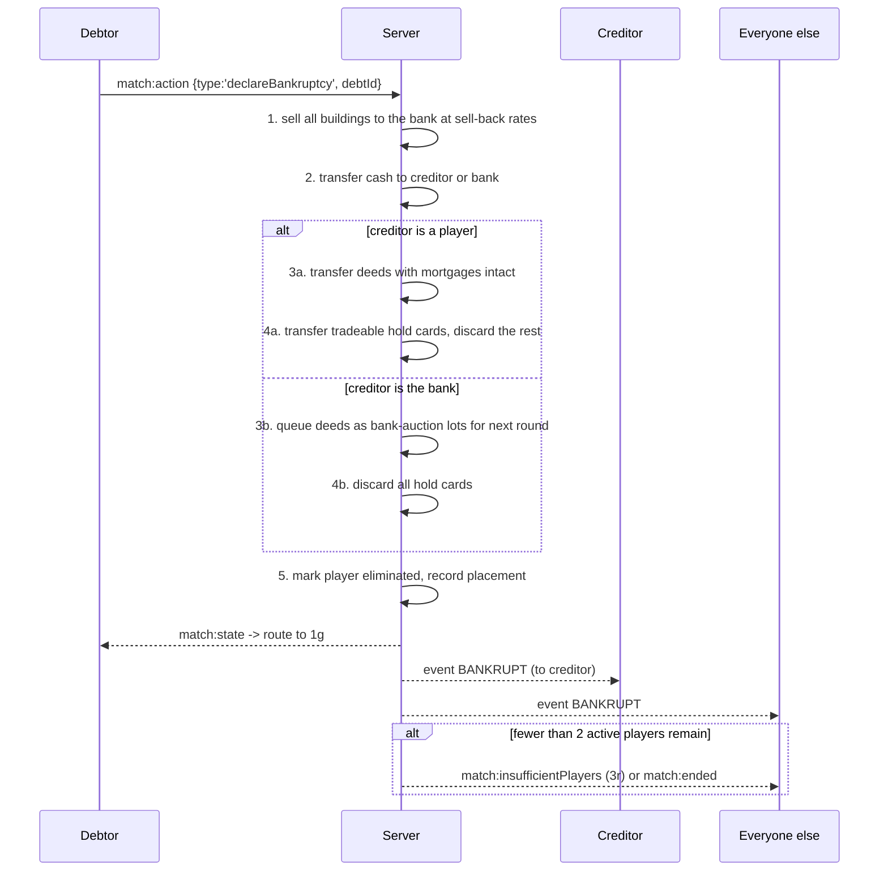

# Flow · Bankruptcy

> Generated from `Royal Navy 1080 v2.dc.html` (Session 9 export) · 19 September 2026.
> Screens: `1d` declare, `1o` outcome card, `1g` out of the match, `1t` bank auction, `2b` result.

## Sequence

## Resolution order (authoritative)

This order is normative — implement it exactly, and test it in this order.

1. **Buildings first.** Every house and hotel the player owns is sold to the bank at that tile's
   sell-back rates. The proceeds join the player's cash. Buildings return to the bank's stock.
2. **Cash.** The player's entire balance goes to the creditor, or to the bank.
3. **Deeds.** To a player creditor: transferred with their mortgages intact — the creditor
   inherits each redeem cost. To the bank: queued as auction lots opening at the start of the next
   round.
4. **Cards.** Hold cards flagged `Tradeable: Yes` transfer with the deeds to a player creditor; all
   others are discarded. A bank bankruptcy discards every card.
5. **Elimination.** The player is marked out with their round and final placement, and routed to
   `1g`. Their token is removed from the board after the `1o` card's topple animation.

## Steps

| # | Step | Screen | Who sees it |
| --- | --- | --- | --- |
| 1 | Declare, with confirm | `1d` | debtor |
| 2 | Resolution applied | — | server only |
| 3 | Outcome card | `1o` | everyone except the debtor |
| 4 | Out of the match | `1g` | debtor |
| 5 | Bank auction lots | `1t` | remaining players, next round |
| 6 | Standings updated | `1g`, `1c` strip | everyone |
| 7 | Match ends if < 2 active | `3r` then `2b` | everyone |

## Failure branches

| Branch | Handling |
| --- | --- |
| Debtor disconnects mid-declaration | The declaration is idempotent by `debtId`; on resync the player lands on `1g` |
| Creditor goes bankrupt in the same chain | Resolve the inner bankruptcy first, then the outer; deeds cascade to the next creditor or the bank |
| Bank has no house stock to receive buildings | Impossible — selling returns stock; the invariant is asserted in the engine |
| Bank auction with fewer than two bidders | Lots stay with the bank unsold; a log line records it |
| Last two players go bankrupt simultaneously | Ranking is by net worth at the moment before resolution; the engine resolves in debt order, never in parallel |
| Bankruptcy on the final round | The match still ends by the normal end condition; the bankrupt player keeps their placement |

## Invariants

1. Cash conservation: the sum of all players' cash plus the bank's balance is unchanged across the
   whole resolution, once building sell-backs are counted.
2. No negative balances at any intermediate step.
3. A deed always carries its mortgage flag; a mortgage is never silently cleared.
4. Building stock returns to the bank in full.
5. Elimination is final — a bankrupt player can never re-enter the match.
6. The resolution is one atomic engine transition, producing one snapshot and one set of log lines.
7. Replaying the match from its seed reproduces the identical bankruptcy sequence.
