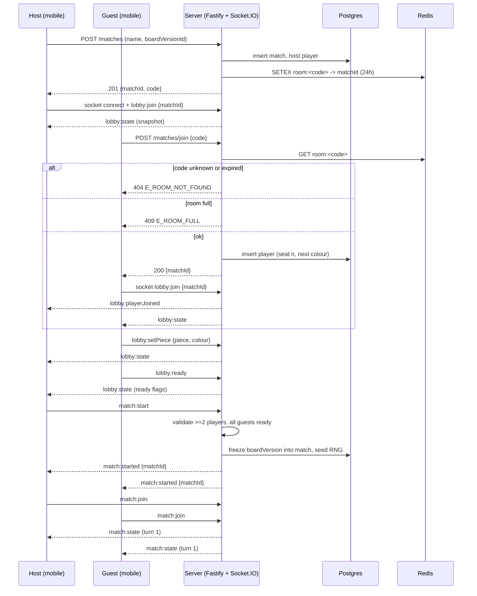

# Flow · Match create and join

> Generated from `Royal Navy 1080 v2.dc.html` (Session 9 export) · 19 September 2026.
> Screens: `3c` → `1b` → `1e` → `1f` → `1b` lobby → `3g` → `1c`.

## Sequence

## Steps

| # | Actor | Step | Screen | Emits / calls | Success | Failure |
| --- | --- | --- | --- | --- | --- | --- |
| 1 | Host | Taps Online multiplayer | `3c` | — | push `/host` | offline → row disabled |
| 2 | Host | Names the room | `1b` setup | — | `Create room` enables at ≥ 1 char | — |
| 3 | Host | Picks a board | `1e` → `1f` | `GET /catalogue` | board card and starting cash refresh | `E_BOARD_UNAVAILABLE` → back to catalogue |
| 4 | Host | `Create room` | `1b` setup | `POST /matches` | replace to `/lobby/[matchId]` | error toast, form preserved |
| 5 | Host | Shares the code | `1b` lobby | — | share sheet with `royalnavy://join/<CODE>` | — |
| 6 | Guest | Opens the link or types the code | `3c` / deep link | `POST /matches/join` | `/lobby/[matchId]` | `E_ROOM_NOT_FOUND`, `E_ROOM_FULL`, `E_MATCH_ALREADY_STARTED` |
| 7 | Guest | Picks a piece and colour | `1b` lobby | `lobby:setPiece` | seat updates for everyone | colour taken → toast |
| 8 | Guest | `Ready` | `1b` lobby | `lobby:ready` | ready flag broadcast | — |
| 9 | Host | Invites friends | `3g` | `lobby:invite` | row marked `Invited` | room full → toast |
| 10 | Host | `Start game` | `1b` lobby | `match:start` | all clients replace to `/match/[matchId]` | fewer than 2 players or someone unready → button disabled with a reason |
| 11 | All | First snapshot | `1c` | `match:join` | turn 1 rendered | socket failure → `3k` |

## Failure branches

| Branch | Detection | Handling |
| --- | --- | --- |
| Code expired | Redis key absent | `E_ROOM_NOT_FOUND` → `/modes` with a toast |
| Room filled between tap and join | Seat count at insert | `E_ROOM_FULL` → `3j` toast `Room is full` / `6 of 6 seats taken.` |
| Match already started | `match.status != 'lobby'` | `E_MATCH_ALREADY_STARTED`; spectating is offered when the board allows it |
| Host leaves before start | `lobby:hostLeft` pre-start | `3r` room-closed takeover for every guest |
| Host leaves after start | `lobby:hostLeft` in match | `3r` toast; host transfers to the longest-seated player |
| Guest disconnects in the lobby | socket close | Seat held for 45s, shown as `waiting…`, then released |
| Board unpublished between pick and start | validation at `match:start` | `E_BOARD_UNAVAILABLE`; the host is returned to the board picker |
| Two guests take one colour | server-side seat lock | second request refused, toast `<name> has that colour.` |

## Invariants

1. A match is created only by an authenticated host; no anonymous rooms.
2. The board version is **frozen into the match** at `match:start` — later publishes never affect a
   running match (decision D5).
3. The RNG seed is fixed at `match:start` and stored, so the match is replayable.
4. Room codes are four characters, unique among live rooms, and expire with the room.
5. Every client receives `match:state` before rendering the HUD; nothing is inferred locally.
