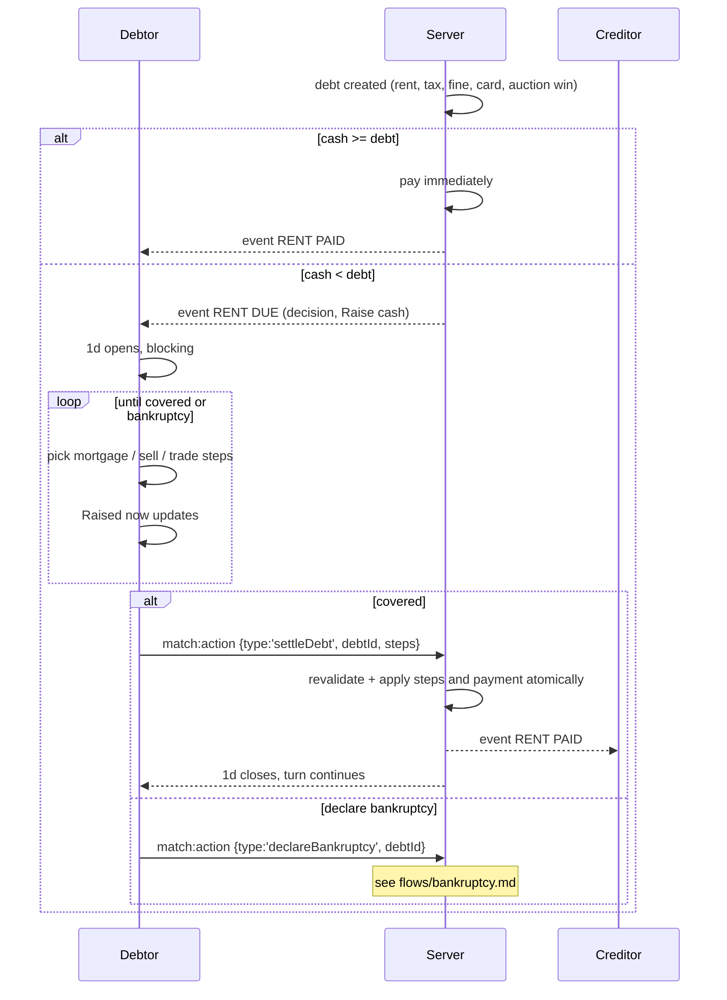

# Flow · Raise cash

> Generated from `Royal Navy 1080 v2.dc.html` (Session 9 export) · 19 September 2026.
> Screens: `1n` rent-due card, `1d` raise cash, `1q` / `1w` / `1p` in restricted mode.

## Sequence

## Steps

| # | Step | Screen | Validation | Result |
| --- | --- | --- | --- | --- |
| 1 | Debt arises | `1n` | `debt > cash` | `RENT DUE` card with `Raise cash` |
| 2 | `1d` opens | `1d` | — | blocking; Android back does nothing |
| 3 | Headroom shown | `1d` | — | mortgage, sell and trade maxima plus `All routes` |
| 4 | Pick a route | `1d` | — | tab switch; picks on other routes are kept |
| 5 | Queue steps | `1d` | route-specific | `Raised now` increases |
| 6 | `Pay ₹<n>` | `1d` | `cash + raised ≥ debt` | steps and payment applied atomically; screen closes |
| 7 | Or declare bankruptcy | `1d` | confirm dialog | see `flows/bankruptcy.md` |

## Route maths

| Route | Raises | Source |
| --- | --- | --- |
| Mortgage | `round(cost × mortgageRate)` per tile | board's mortgage rate, default 50% |
| Sell | `round(houseCost × sellHouseRate)`, `round(hotelCost × sellHotelRate)`, `round(cost × sellPropertyRate)` | per-tile rates from `1x` |
| Trade | The cash side of a standing offer you accept | the other player's offer |

`All routes` is the sum of each route's maximum, ignoring overlap between routes for the same tile
— it is an upper bound to tell the player whether the debt is payable at all.

## Failure branches

| Branch | Handling |
| --- | --- |
| Even all routes fall short | The screen states `Even all routes together fall ₹<n> short.` and `Declare bankruptcy` takes primary weight; `Pay` stays disabled |
| A queued tile changes hands mid-flow (accepted trade) | The step is dropped with a toast and `Raised now` recalculates |
| An accepted offer expires while queued | Same |
| Server revalidation fails on `Pay` | Nothing is applied; the selection is preserved and the error is toasted |
| Debtor disconnects | The debt stands; the turn hold expires and the turn ends with the debt open; it is re-presented at the start of their next turn |
| Debt unpayable at the start of the next turn | Automatic bankruptcy resolution, with the card in `1o` |
| Multiple debts at once | Resolved oldest first, one `1d` session per debt |

## Invariants

1. `1d` is the **only** screen that can be entered involuntarily and cannot be dismissed.
2. No automatic liquidation ever happens — the player chooses every step, or declares bankruptcy.
3. The turn timer does not run while `1d` is open.
4. Steps plus payment apply as one atomic action; a partially liquidated player is never left in a
   half-paid state.
5. Cash conservation holds: the bank's payouts and the creditor's receipt balance exactly.
6. A player can never be forced below ₹0 — redeeming and building are blocked, only the debt can
   take them to zero.
