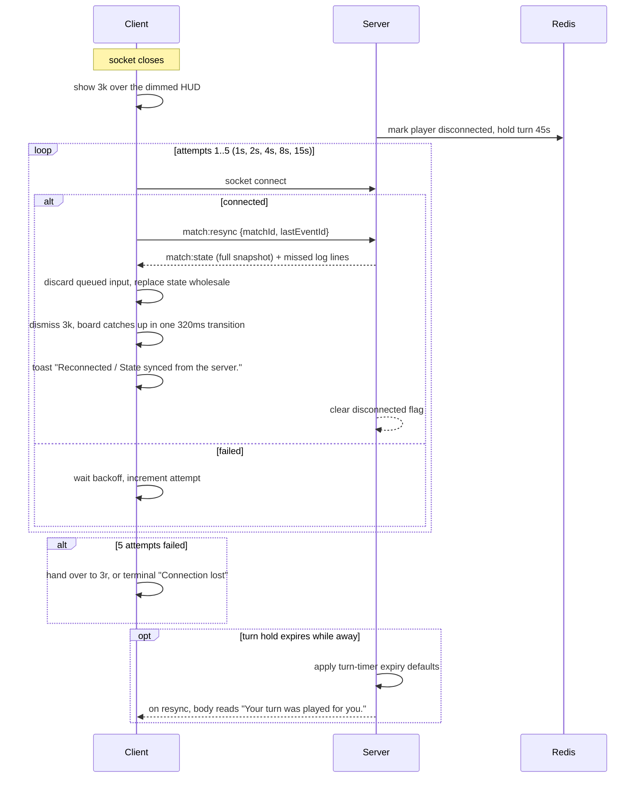

# Flow · Reconnect

> Generated from `Royal Navy 1080 v2.dc.html` (Session 9 export) · 19 September 2026.
> Screens: `3k` overlay, `3r` interruptions, `3j` reconnected toast, `1c` HUD.

## Sequence

## Parameters

| Parameter | Value |
| --- | --- |
| Max attempts | 5 |
| Backoff | 1s, 2s, 4s, 8s, 15s (no jitter — the attempt number is shown) |
| Turn hold | 45s from the disconnect, independent of the board's turn timer |
| Foreground resume | Attempt immediately, backoff resets to 1s |
| Resync payload | Full snapshot, never a patch |

## Steps

| # | Step | Screen | Result |
| --- | --- | --- | --- |
| 1 | Socket drops | `3k` | overlay within 1000ms over a dimmed, still-rendered HUD |
| 2 | Attempts run | `3k` | body counts the attempt and the remaining turn hold |
| 3 | `Retry now` | `3k` | cancels the wait and attempts immediately |
| 4 | Reconnected | `1c` | full snapshot replaces local state; `Reconnected` toast; board catches up in one transition |
| 5 | Hold expired | `3k` → `1c` | `Your turn was played for you.`; the defaults have already been applied |
| 6 | Five failures | `3r` | `Ended while you were away`, `Host left`, or the terminal `Connection lost` |

## Failure branches

| Branch | Handling |
| --- | --- |
| Match ended while away | `3r` `Ended while you were away` with placement, final net worth, winner and the auto-played turn count |
| Host left while away | `3r` host-left state; play has continued |
| Room closed while away (pre-start) | `3r` room-closed takeover |
| Player was made bankrupt while away | Resync lands on `1g`, not the HUD |
| Airplane mode | Attempts stop; body becomes `You're offline. Turn on your connection to rejoin.`; `Retry now` stays live |
| Server unreachable entirely after 5 attempts | Terminal state with a single `Back to Game modes` action |
| Auction was live and resolved while away | Only the log shows it; no replay, no retroactive bid |
| Client clock drift | Irrelevant — every deadline is server-supplied as `secondsRemaining` |

## Invariants

1. The client never resolves game actions while disconnected.
2. Queued local input is discarded on resync — the snapshot is the truth.
3. Missed moves are never replayed as animation; the board transitions once.
4. The turn hold is 45 seconds regardless of the board's turn timer.
5. Reconnecting is idempotent: repeated resyncs produce the same state.
6. Local modes (pass-and-play, solo) never enter this flow — they have no socket.
