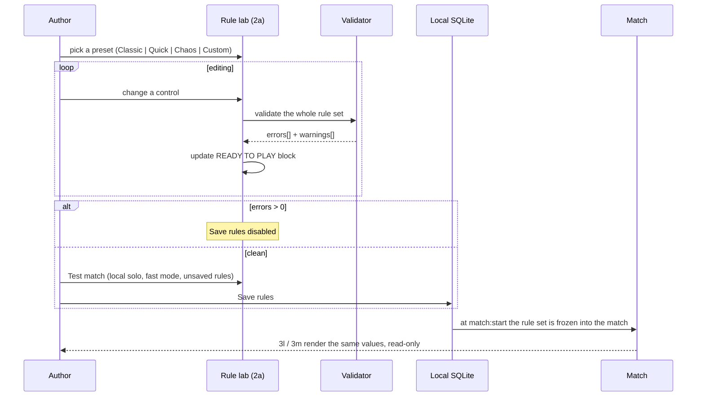

# Flow · Rule Lab

> Generated from `Royal Navy 1080 v2.dc.html` (Session 9 export) · 19 September 2026.
> Screens: `2a` rule lab panel, `1z` rule library, `1y` decks, `3l` / `1f` / `3m` read-only faces.

## Sequence

## Control groups

| Group | Controls |
| --- | --- |
| Preset | `Classic`, `Quick`, `Chaos`, `Custom`; changing any control switches the preset to `Custom` |
| Filter | `All`, `Changed (<n>)` |
| Houses and hotels | houses in the bank, hotels in the bank, houses before a hotel, hotel returns houses |
| Colour sets | threshold mode (`All tiles`, `Majority`, `Custom`), mortgage breaks the set, build evenly, per-group overrides |
| Money | sell, mortgage, redeem, buying and rent |
| Rounds and pace | round cap (10–200), turn timer (`15s`, `30s`, `45s`, `Off`), endgame |

The **turn timer lives here and nowhere else** (decision D1). There is no match-time override.

## Validation

| Kind | Blocks save | Examples |
| --- | --- | --- |
| Error | yes | a rule contradicts another; a threshold no group can reach; a negative or zero cap |
| Warning | no | `Majority needs an odd group size` / `Sky has 4 tiles — a 2 and 2 split holds no set`; `Mortgage breaks the set is on` / `Tight games will lose set rent often` |

Scope note, shown verbatim in the panel: `Tiles, slots and colour-set counts are checked in Board
settings. This panel only checks the rules.`

## Steps

| # | Step | Screen | Result |
| --- | --- | --- | --- |
| 1 | Open from board settings | `2a` | current rule set loaded |
| 2 | Pick a preset | `2a` | all controls set; preset chip highlights |
| 3 | Edit any control | `2a` | preset becomes `Custom`; `Changed (<n>)` count rises |
| 4 | Read the validator | `2a` | `ERRORS · n` and `WARNINGS · n` update live |
| 5 | `Test match` | `1c` local | a solo match on the unsaved rules, fast mode on; exiting returns here with edits intact |
| 6 | `Save rules` | `2a` | rules persisted to the board; board settings shows `Classic + <n> changes` |
| 7 | Publish | `2a` | rule errors are publish check 3 |
| 8 | In match | `3l`, `3m`, `1f` | the same values, read-only, three presentations |

## Failure branches

| Branch | Handling |
| --- | --- |
| Contradiction introduced | Error appears immediately with a `Fix` action that scrolls to the offending control; `Save rules` disables |
| Preset applied over custom edits | Confirm `Replace your changes?` before applying |
| `Test match` with errors | Refused; the button is disabled with `Fix the errors first.` |
| Rule set saved but the board has no matching tiles | Not a rule error — it surfaces as a board error in board settings |
| A referenced deck is deleted | Board error, not a rule error |
| Editing rules on a published board | Produces the next version's working copy, like any other board edit |

## Invariants

1. Rules belong to the board; a match never overrides them.
2. `3l`, `3m` and `1f`'s rulebook all render from the same saved object — one source, three faces.
3. Warnings never block saving; errors always do.
4. A preset is a starting point, not a mode — after any edit the board is `Custom`.
5. `Test match` never writes to the board; it runs against the in-memory edit.
6. Rules are frozen into the match at `match:start`, so a later edit cannot change a running game.
