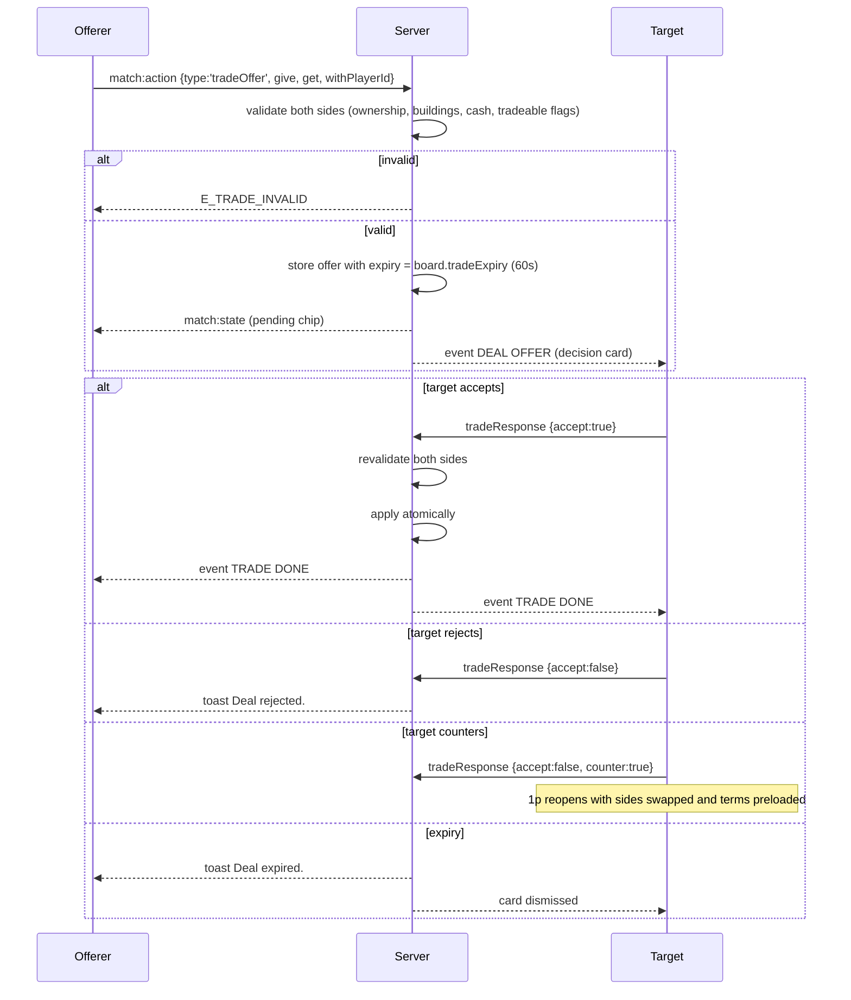

# Flow · Trade

> Generated from `Royal Navy 1080 v2.dc.html` (Session 9 export) · 19 September 2026.
> Screens: `1p` deal composer, `1n` deal-offer and trade-done cards, `1d` trade route.

## Sequence

## Steps

| # | Step | Screen | Validation | Result |
| --- | --- | --- | --- | --- |
| 1 | Open the composer | `1v` → `1p` | trading on, ≥ 1 other active player | side switch defaults to `Me` |
| 2 | Pick a partner | `1p` | active players only | changing the partner clears their side, after a confirm |
| 3 | Select tiles | `1p` | tradeable, no buildings in the group | badge added, summary updates |
| 4 | Set cash | `1p` | 0 ≤ value ≤ that side's balance | summary updates |
| 5 | Send | `1p` | ≥ 1 item in total | pending chip on the HUD with the expiry countdown |
| 6 | Respond | `1n` | — | accept, reject, or counter |
| 7 | Apply | `1c` | server revalidation passes | both sides updated in one snapshot; `TRADE DONE` cards |

## What is tradeable

| Tradeable | Not tradeable |
| --- | --- |
| Unmortgaged tiles | Tiles whose colour group carries buildings |
| Mortgaged tiles (mortgage travels with the deed) | Buildings |
| Cash, either direction | Cards flagged `Tradeable: No` in `1z` |
| Hold cards flagged `Tradeable: Yes` | Turn order, board position, jail status |

## Failure branches

| Branch | Handling |
| --- | --- |
| Ownership changed between compose and accept | Server revalidation fails, `E_TRADE_INVALID`; both sides toast `That deal is no longer valid.` |
| Either side's cash fell below its offer | Same refusal |
| A building appeared on a traded group | Same refusal |
| Target disconnects with the card open | The offer stands until expiry; their card is re-shown on reconnect if time remains |
| Offerer goes bankrupt before acceptance | The offer is cancelled and both sides are toasted |
| Offer expires | Both sides toasted; a match-log line records the expiry |
| Trading off on the board | The actions row is disabled with `Trading is off on this board.` |
| Set broken by the trade | Allowed — the composer warns with `Set held: broken`, it never blocks |

## Invariants

1. Both sides are validated at compose time **and** again at accept time.
2. Application is atomic: tiles, cash and cards move in one state transition, or none do.
3. A trade can be pending against only one partner at a time per offerer.
4. Trades never create or destroy money — cash conservation holds across the transition.
5. Mortgages always travel with their deed; the receiver inherits the redeem cost.
6. Only the target may accept; a third player cannot intercept an offer.
