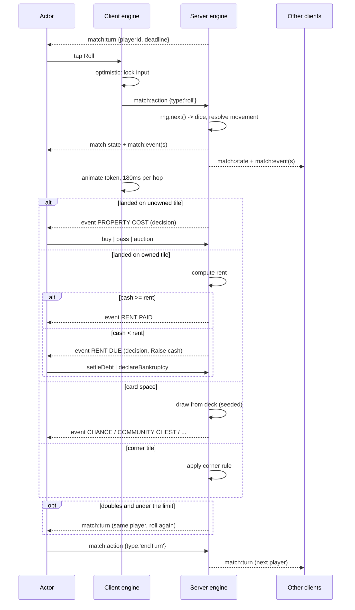

# Flow · A turn

> Generated from `Royal Navy 1080 v2.dc.html` (Session 9 export) · 19 September 2026.
> Screens: `1c` HUD, `1n` cards, `1v` actions, `1d` raise cash, `3k` reconnect.

## Sequence

## Steps

| # | Step | Screen | Validation | Server | Result |
| --- | --- | --- | --- | --- | --- |
| 1 | Turn opens | `1c` | actor is you | `match:turn` | primary action reads `Roll`; the timer starts if the board sets one |
| 2 | Roll | `1c` | your turn, no modal | `match:action roll` | dice from the seeded RNG; token animates |
| 3 | Movement | `1c` | — | server-computed | wraps at the ring end; passing GO pays the salary (`START BONUS` card) |
| 4 | Landing resolution | `1n` | per tile type | server-computed | one of: purchase decision, rent, card draw, corner rule, no-op |
| 5 | Optional actions | `1v` | actor's turn | per child screen | build, sell, mortgage, redeem, trade, auction |
| 6 | Doubles | `1c` | under the doubles limit | `match:turn` | roll again; the third double sends you to jail |
| 7 | End turn | `1c` | nothing unresolved | `match:action endTurn` | next player's turn |

## Turn-timer expiry (default actions)

When the board sets a turn timer and it reaches zero, the **server** applies, in order:

1. If awaiting a roll — roll and resolve the landing.
2. If a purchase decision is open — decline; an auction opens when `Auction on decline` is on.
3. If a jail decision is open — roll for doubles; no bail is paid.
4. If a trade offer is open — reject it.
5. If raise cash is open — no forced liquidation: the debt stands and the turn ends; the debt is
   settled at the start of the player's next turn or resolves as bankruptcy if still unpayable.
6. End the turn.

No build, sell, mortgage or trade is ever performed automatically.

## Failure branches

| Branch | Handling |
| --- | --- |
| Action rejected by the server | Client rolls the optimistic state back to the last snapshot and toasts the error code; no partial state is kept |
| Actor disconnects mid-turn | `3k` on their device; the server holds the turn for 45s, then applies the expiry defaults |
| Actor disconnects mid-decision | Same — the decision's default applies |
| Client state diverges from a snapshot | The snapshot wins, always; the divergence is logged as a bug-level event |
| Rent owed exceeds cash | `1d` opens, blocking, until paid or bankruptcy |
| Deck exhausted | The deck reshuffles from its full composition using the seeded RNG |

## Invariants

1. Only the server advances turn state; the client's optimistic apply is a rendering shortcut.
2. Both sides run the **same** `packages/game-engine` build — a divergence is a defect.
3. Every random draw comes from the match's seeded RNG; `Math.random()` appears nowhere in the
   engine or in server match code.
4. Money is integer rupees end to end.
5. Every state change appends exactly one match-log line, server-generated.
6. A turn cannot end with an unresolved debt or an open decision.
